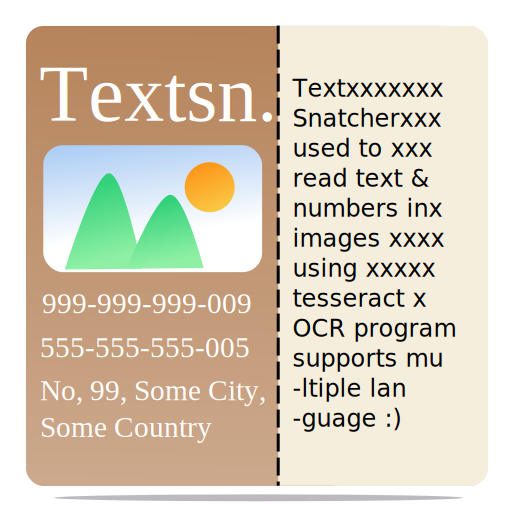
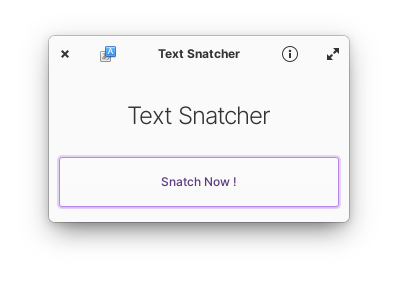
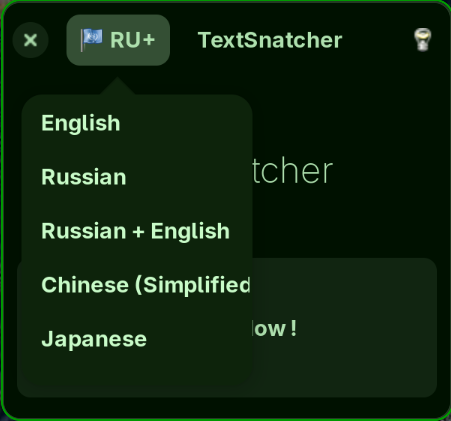
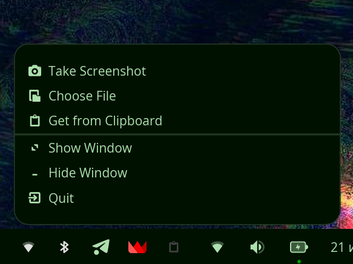

<div align="center">

<h1>TextSnatcher</h1>
<p>Copy Text from Images with ease. Fast and modern OCR for Linux.</p>

[](https://wiki.gnome.org/Projects/Vala)


</br>
</div>

---

## ✨ Key Features & Improvements

### 🌐 Dual Language Support (Russian + English Hybrid OCR)
TextSnatcher supports simultaneous **Russian + English (`rus+eng`)** OCR mode (`RU+`). 
This allows seamless recognition of mixed text — code snippets, technical documentation, bilingual UI elements, and memes without dropping English technical terms or Latin characters.

<div align="center">

</div>

### 📌 System Tray Integration & Background Mode
Full System Tray support for **COSMIC / Wayland** (via `ayatana-appindicator3` and StatusNotifierItem D-Bus export) and **X11** desktop environments:
- **Take Screenshot directly from tray** without raising or unhiding the main window.
- **Close to Tray:** Clicking the window close button (`X`) minimizes TextSnatcher to the system tray instead of terminating the app.
- **Silent Background Operation:** Screenshots and OCR operations can run completely in the background without stealing window focus or interrupting your workflow.

<div align="center">

</div>

### 📸 Next-Gen Screenshot Engine & Desktop Compatibility

The screenshot engine has been completely overhauled to support modern Linux display servers and compositors:

- **Wayland (Native `grim` + `slurp`):** High-performance cropped area selection on Wayland. Includes a 200ms non-blocking delay to resolve Wayland seat grab conflicts with closing panel menus, and direct `wl-copy` integration so copied text is placed on the clipboard even when the main window is hidden.
- **COSMIC Desktop Integration:** *(Custom extension added by Andrey4952)* — exports D-Bus menus for System76 COSMIC Desktop's StatusNotifierWatcher and KDE StatusNotifierWatcher seamlessly.
- **XDG Desktop Portal Fallback:** Automatic fallback to `libportal` (`Xdp.Portal`) if native CLI screenshot utilities are unavailable.
- **X11 Compatibility:** Uses `scrot` for legacy X11 sessions.

#### 💻 Supported Desktop Environments & Compositors

| Environment / Compositor | Screenshot Backend | System Tray Support |
|--------------------------|--------------------|---------------------|
| **COSMIC Desktop (System76)** | `grim` + `slurp` / Portal | Native (`CosmicTray` D-Bus SNI) |
| **Sway / Hyprland / wlroots** | `grim` + `slurp` | AppIndicator / SNI |
| **KDE Plasma (Wayland & X11)** | `grim` + `slurp` / `scrot` | Native StatusNotifierItem |
| **GNOME (Wayland & X11)** | XDG Desktop Portal / `scrot` | AppIndicator Extension |
| **XFCE / MATE / Cinnamon (X11)** | `scrot` | Native GTK Tray |

---

## 🛠 Dependencies

Ensure you have these dependencies installed:

### Runtime Dependencies

- `tesseract-ocr` & language data ([arch repos](https://archlinux.org/packages/extra/x86_64/tesseract/), [debian repos](https://packages.debian.org/search?keywords=tesseract-ocr))
- `grim` & `slurp` (for Wayland area selection)
- `wl-clipboard` (`wl-copy` / `wl-paste` for Wayland clipboard support)
- `scrot` (for legacy X11 screenshot capture)

### Buildtime Dependencies

- `granite`
- `gtk+-3.0`
- `gobject-2.0`
- `gdk-pixbuf-2.0`
- `libhandy-1`
- `libportal` (libportal-0.5+)
- `ayatana-appindicator3-0.1`

---

## 🚀 Install, Build and Run

```bash
# Clone repository
git clone https://github.com/Andrey4952/TextSnatcher.git
cd TextSnatcher

# Configure build with Meson
meson setup build --prefix=/usr/local

# Compile and install
ninja -C build
sudo ninja -C build install

# Run TextSnatcher
com.github.rajsolai.textsnatcher
```

---

## 💡 Inspirations & Credits

- Original Upstream Application: [RajSolai/TextSnatcher](https://github.com/RajSolai/TextSnatcher)
- ReadMe Structure: [alainm23/planner](https://github.com/alainm23/planner)
- Application Structure: [alcadica/develop](https://github.com/alcadica/develop)
- TextSniper (macOS Application)

Made with ❤️ for Linux
